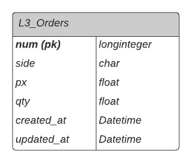

# t2ó

### Environment
* python 3.8.12
* django==3.2.9
* django-rest-framework==3.12.4
* numpy==1.21.4
* pandas==1.3.4

Lista de requerimientos completa en **requirements.txt**

---
### **Instalación de la App**

Para usar la App **debe contar con un VirutalEnv** de python basado en este caso en la versión 3.8.12. Y debe instalar los requerimientos con el siguiente comando:

`pip install -r requirements.txt`

La App está basada en el framework  de Django. Por lo que **una vez activado el virtualenv** e **instalados** los requerimientos deberá ejecutar los siguientes comandos para finalizar la instalación:

* `python manage.py makemigrations`
* `python manage.py migrate`

---
### **Uso de la App**

_** Importante: Todos los comandes deben de ser ejecutados desde la carpeta `t2o`_
1. Carga de las Ordenes L3

Para cargar las órdenes desde la API, deberá ejecutar el siguiente comando:

`python manage.py orders --get-coin [Simbolo]` donde símbolo puede ser: BTC-USD, ETH-USD, BTC-EUR o cualquier simbolo válido para la API. Por ejemplo:

* `python manage.py orders --get-coin BTC-USD`
* `python manage.py orders --get-coin BTC-EUR`

2. Reinicio de la Base de Datos

Si desea borrar todos los registros guardados dentro de la Base de Datos basta con ejecutar el siguiente comando:

* `python manage.py orders --clean-database`

3. Para ejecutar el servidor Web y activar los enpoints de estadísticas deberá ejecutar el siguiente comando:

* `python manage.py runserver`

----
### **Suposiciones**

Para efectos de este ejercicio, he definido las siguientes suposiciones:

* Cada orden tiene un ID único sin importar la moneda que sería el campo **`num`**.
* El comando de extración puede ser ejecutado multiples veces y la app añade ordernes nuevas, o si el ID de la order existe, actualiza su contenido.
* Una orden puede ser cambiada de precio y cantidad manteniendo su ID.

----
### **Data Model**



----
### **Referencia de API Endpoints**

Se crearon dos endpoints:

|Método    |Endpoint    |Uso    |
|----------|------------|---------|
|GET       |/api/v1/stats/| Devuelve las estadísticas generales|
|GET       |/api/v1/stats/{symbol}/asks/| Devuelve las estadísticas detalladas de un símbolo (BTC-USD, ETH-USD, etc.)| 
|GET       |/api/v1/stats/{symbol}/bids/| Devuelve las estadísticas detalladas de un símbolo (BTC-USD, ETH-USD, etc.)|

Para utilizar la API, basta con hacer un Request del tipo GET a `localhost:8000` al endpoint deseado.

Ejemplo: `localhost:8000/api/v1/stats/BTC-USD/asks/`

_____
### **Tests**

Para efectos de demostración, he creado un par de tests que evaluán lo siguiente:

* Se comprueba que el cálculo de `total_qty` en el caso de petición de los `asks` es correcto.
* Se comprueba cuando se solicita en las estadisticas detalladas `asks` efectivamente la respuesta pertenece a ese tipo de órdenes.
* Se comprueba que cuando se solicita las estadísticas general, se retorna el reporte para todas las monedas disponibles en la base de datos.

Para la ejecución de los tests, es necesario correr desde la carpeta t2o el siguiente comando:
* `python manage.py test`

____
### **Potenciales Mejoras**

* Ya que he incluido los campos `created_at` y `updated_at`, asumiendo que el proceso pueda ser ejecutado automáticamente cada cierto tiempo, sería interesante a la hora de calcular las estadísticas limitarlas por fecha de cuando se registro la orden en la base de datos, por ejemplo.
______
### Ejemplos de Respuestas
```
->localhost:8000/api/v1/stats/BTC-USD/asks/

{
    "asks": {
        "average_value": 14506.23673325479,
        "greater_value": {
            "px": 59000.0,
            "qty": 2.856,
            "num": 281488747108214,
            "value": 168504.0
        },
        "lesser_value": {
            "px": 60000.0,
            "qty": 0.0005,
            "num": 281488681121348,
            "value": 30.0
        },
        "total_qty": 60.577369669999996,
        "total_px": 22826344.28
    }
}
````
````
-> localhost:8000/api/v1/stats/BTC-USD/bids/

{
    "bids": {
        "average_value": 11140.560152623813,
        "greater_value": {
            "px": 57128.21,
            "qty": 1.95750961,
            "num": 281488760350887,
            "value": 111829.0200770981
        },
        "lesser_value": {
            "px": 500.0,
            "qty": 0.0009,
            "num": 281488379309487,
            "value": 0.45
        },
        "total_qty": 79.70294212,
        "total_px": 11816691.72
    }
}
````

````
-> localhost:8000/api/v1/stats/

{
    "BTC-USD": {
        "bids": {
            "count": 247,
            "qty": 79.70294212,
            "value": 2751718.357698082
        },
        "asks": {
            "count": 252,
            "qty": 60.577369669999996,
            "value": 3655571.656780207
        }
    },
    "ETH-USD": {
        "bids": {
            "count": 73,
            "qty": 224.71174158,
            "value": 959437.2068643745
        },
        "asks": {
            "count": 54,
            "qty": 233.12570524,
            "value": 1165056.352140537
        }
    }
}
````
*Creado por __José Fernando González Montero__*

